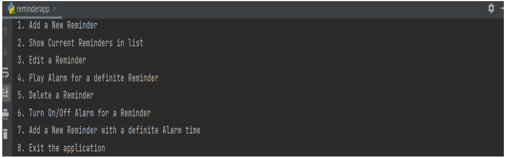
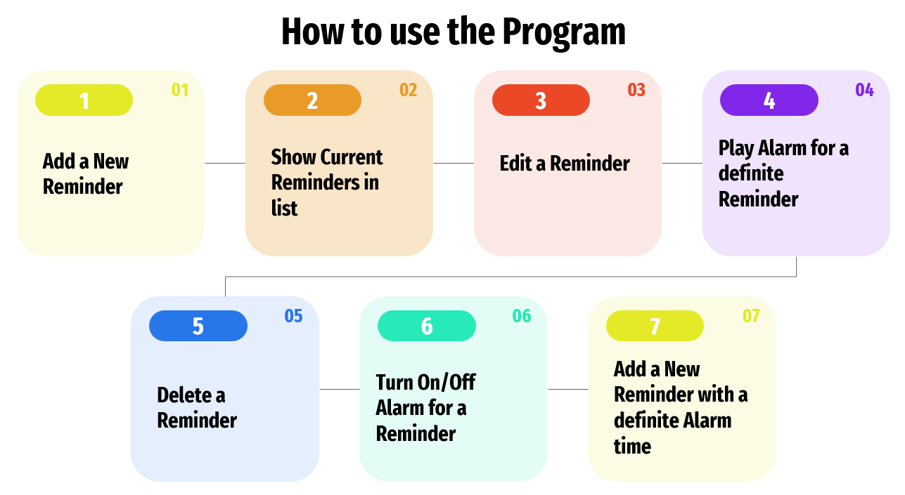
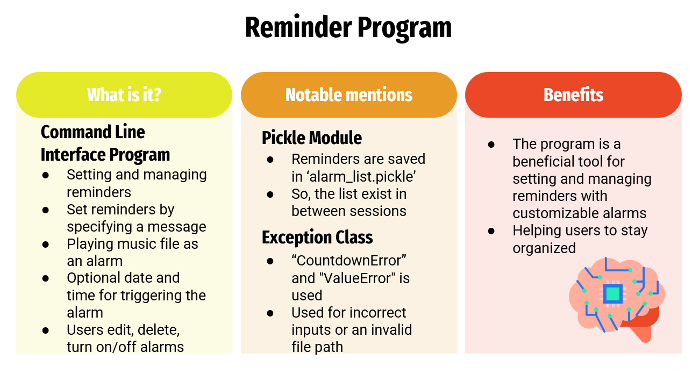

# Reminder_Alarm_Program_CLI_Python
This is a simple command-line reminder app written in Python. It allows users to create, edit, delete, and trigger reminders with custom messages and alarm sounds, and turn on/off alarms for each reminder. The app uses the datetime module to set and calculate alarm times, and the playsound library to play the alarm sounds. The app also provides a data persistence feature using pickle to store the reminders in a binary file for future use.

## Output of the program on Terminal

## How to use the program

## Reminder Program

To use the app, simply run the main() function in the reminder.py file and follow the prompts. 
You can add a new reminder, 
show the current reminders, 
edit a reminder, 
play the alarm for a definite reminder, 
delete a reminder, 
turn on/off the alarm for a reminder, or
add a new reminder with a definite alarm time. 

You can also exit the app at any time, which automatically saves the current reminders to a file named alarm_list.pickle in the same directory.

